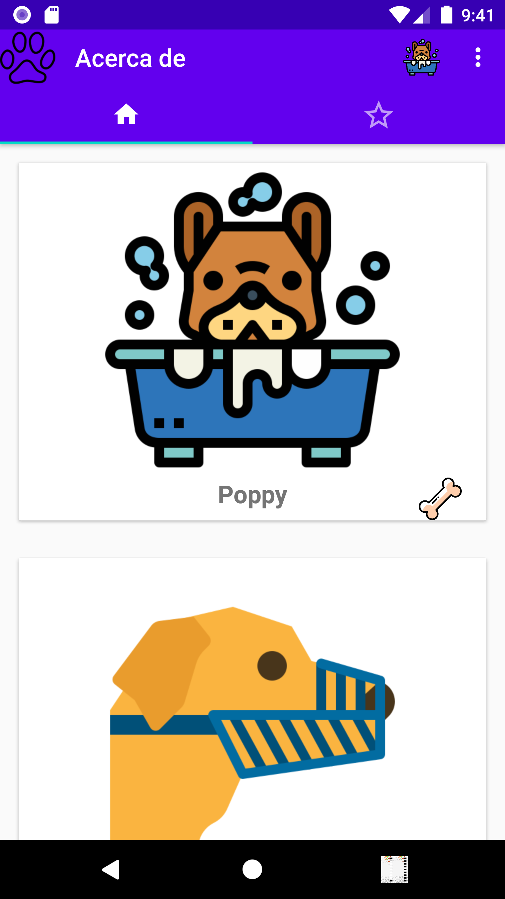
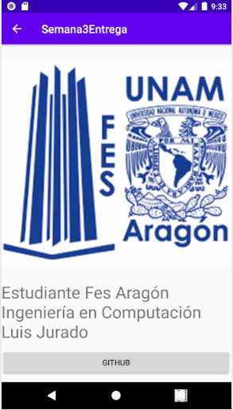
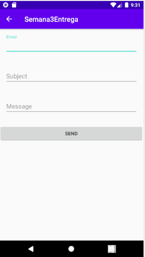
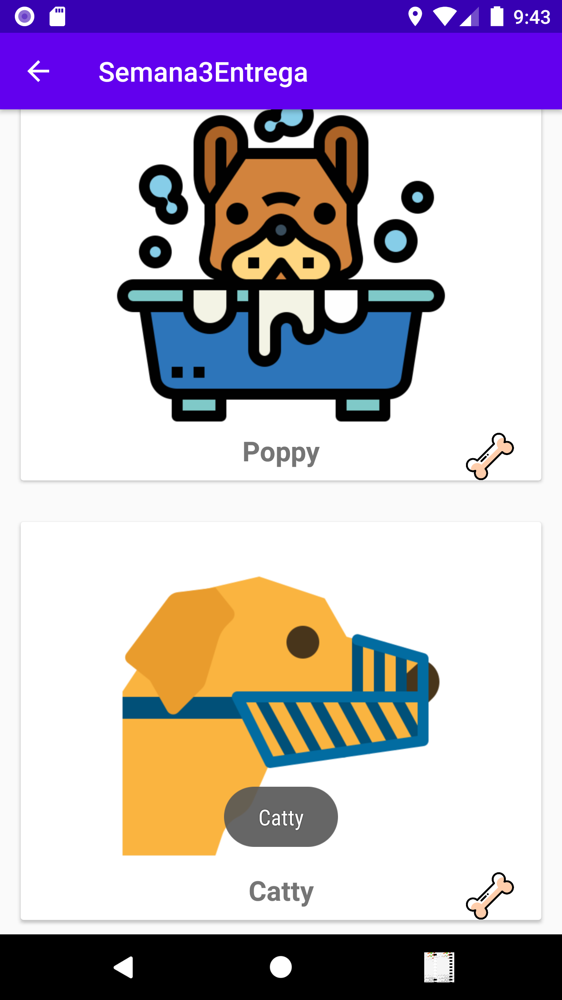
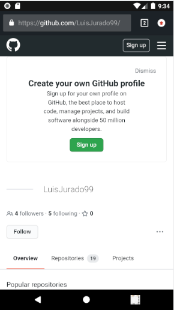
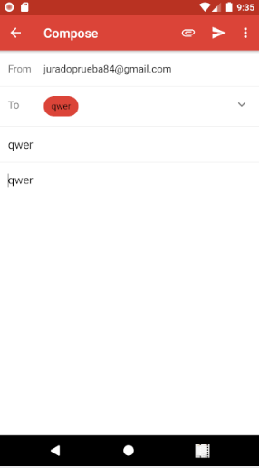

## Entrega de la semana 3 de Android

## Nota: No se ocupo el MAIL debido a la desactualización de la libreria en cambio se usaron intent que envian al GMAIL con los datos ya incrustados.
#### Pantalla principal

#### Pantalla de Perfil

#### Pantalla About

#### Pantalla de Contacto 

#### Pantalla de Likes

#### Pantalla Boton con Acción a GitHub Funciona y manda al Repo Local

#### Pantalla de Boton de Envio a Gmail mandando al GMAIL con los Datos

